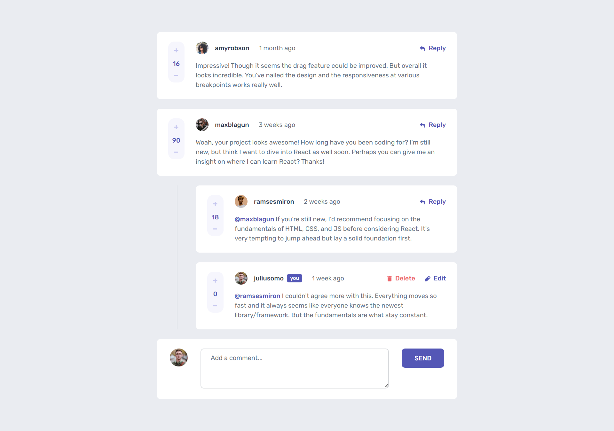

# Frontend Mentor - Interactive comments section solution

This is a solution to the [Interactive comments section challenge on Frontend Mentor](https://www.frontendmentor.io/challenges/interactive-comments-section-iG1RugEG9). 

## Table of contents

- [Overview](#overview)
  - [The challenge](#the-challenge)
  - [Screenshot](#screenshot)
  - [Links](#links)
- [My process](#my-process)
  - [Built with](#built-with)

## Overview

### The challenge

Users should be able to:

- View the optimal layout for the app depending on their device's screen size
- See hover states for all interactive elements on the page
- Create, Read, Update, and Delete comments and replies
- Upvote and downvote comments
- Dynamically track the time since the comment or reply was posted.

### Screenshot

### Links
- This project was built using json-server to fetch json files. Use the following syntax to start json-server
- npx json-server --w data/data.json --p 3500
- If you wish to change the port other than 3500, make sure to change it in App.js as well.
- Solution URL: [https://github.com/1LE00/interactive-comments-section]

## My process

### Built with

- Semantic HTML5 markup
- CSS custom properties
- Flexbox
- Mobile-first workflow
- json-server
- [React](https://reactjs.org/) - JS library

